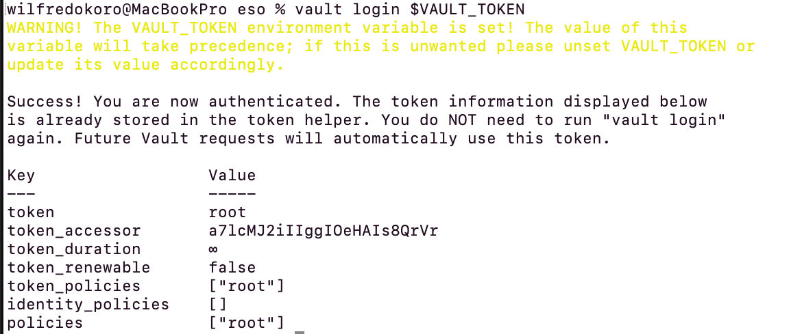
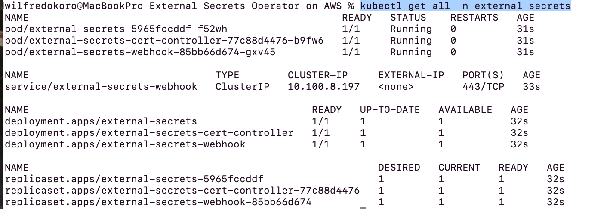
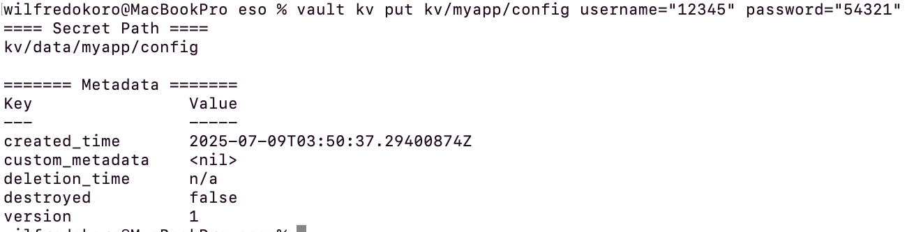
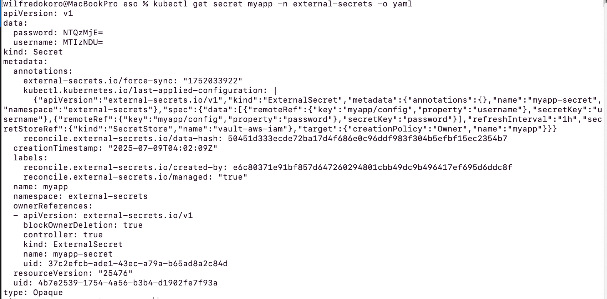
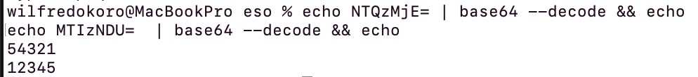
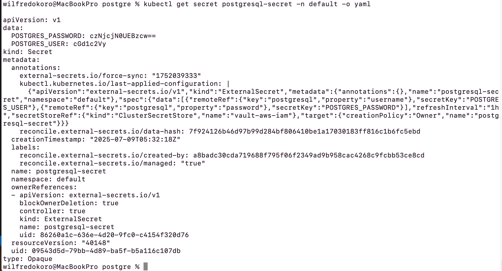
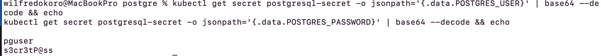
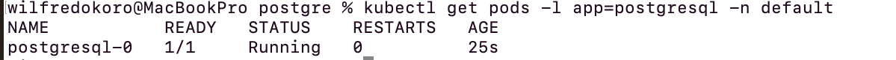
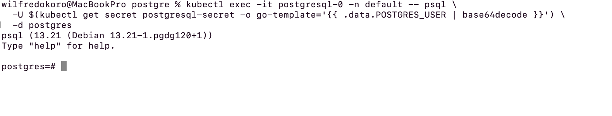

## Prerequisites
- Kubernetes cluster 

- kubectl configured to access your cluster

- Helm installed

- AWS account (if using AWS for external secrets)

```bash
export AWS_ACCOUNT_ID=<Account-ID>
export CLUSTER_NAME=fred01
```

## 1. Enable IAM OIDC on EKS 

```bash
eksctl utils associate-iam-oidc-provider \
  --cluster $CLUSTER_NAME \
  --region us-east-1 \
  --approve
```

## 2. Create IAM Policy for External-Secrets IRSA

```bash
# vault-auth-policy.json
{
  "Version": "2012-10-17",
  "Statement": [{
    "Effect": "Allow",
    "Action": ["sts:AssumeRoleWithWebIdentity"],
    "Resource": "*"
  }]
}

aws iam create-policy \
  --policy-name ExternalSecretsVaultAuthPolicy \
  --policy-document file://vault-auth-policy.json

export ES_VAULT_POLICY_ARN=$(aws iam list-policies \
  --query "Policies[?PolicyName=='ExternalSecretsVaultAuthPolicy'].Arn" \
  --output text)

```
policy ARN: arn:aws:iam::<Account-ID>:policy/ExternalSecretsVaultAuthPolicy    #delete 

OIDC:  oidc.eks.us-east-1.amazonaws.com/id/E7FCD5F8416707138082CEE9AF9891D8   3delete

## 3. Create IAM Role & Trust Policy for IRSA

### 3.1 Get your cluster’s OIDC issuer and form the provider ARN:

```bash
OIDC_ISSUER_URL=$(aws eks describe-cluster \
  --name $CLUSTER_NAME \
  --query "cluster.identity.oidc.issuer" \
  --output text | sed -e "s~https://~~")
export OIDC_PROVIDER_ARN="arn:aws:iam::$AWS_ACCOUNT_ID:oidc-provider/$OIDC_ISSUER_URL"
```
### 3.2 Write the trust policy (es-vault-trust.json) including the aud claim:
```json
{
  "Version": "2012-10-17",
  "Statement": [{
    "Effect": "Allow",
    "Principal": { 
    "Federated": "arn:aws:iam::<Account-ID>:oidc-provider/oidc.eks.us-east-1.amazonaws.com/id/<OIDC-ID>",
    "Action": "sts:AssumeRoleWithWebIdentity",
    "Condition": {
      "StringEquals": {
        "oidc.eks.us-east-1.amazonaws.com/id/<OIDC-ID>:sub": "system:serviceaccount:external-secrets:external-secrets",
        "oidc.eks.us-east-1.amazonaws.com/id/<OIDC-ID>:aud": "sts.amazonaws.com""
      }
    }
  }]
}
```

### 3.3 Create the role and attach the policy:

```bash
aws iam create-role \
  --role-name ES-Vault-Auth-Role \
  --assume-role-policy-document file://es-vault-trust.json

aws iam attach-role-policy \
  --role-name ES-Vault-Auth-Role \
  --policy-arn $ES_VAULT_POLICY_ARN
```
Role ARN: "arn:aws:iam::<Account-ID>:role/ES-Vault-Auth-Role",

## 4. Deploy Vault into Kubernetes

```bash
helm repo add hashicorp https://helm.releases.hashicorp.com
helm repo update
kubectl create namespace vault
```
### Install Vault using dev for simplicity
```bash
helm install vault hashicorp/vault \
  --namespace vault \
  --set "server.dev.enabled=true"
```
### Port-Forward to Vault

```bash
kubectl port-forward svc/vault 8200:8200 -n vault
```


### open another shell:
```bash
export VAULT_ADDR=http://127.0.0.1:8200
```
### Initialize & Unseal Vault (Dev Mode is auto-unsealed)
If you installed in dev mode, Vault is auto-initialized and unsealed. Retrieve its root token:
```bash
kubectl logs sts/vault -n vault | grep "Root Token"
export VAULT_TOKEN=<dev-root-token>
```

5. Enable & Configure AWS Auth in Vault
```bash

vault login $VAULT_TOKEN
```


```bash
vault auth enable aws

# Configure AWS credentials (use an AWS key with iam:PassRole on ES-Vault-Auth-Role)
vault write auth/aws/config/client \

  region=us-east-1
```
## 6. Create Vault Policy & AWS-Auth Role
### 6.1 create policy {external-secrets.hcl}

```hcl
# Read values from KV-v2
path "kv/data/*" {
  capabilities = ["read"]
}

# Fetch DB credentials from your DB engine
path "database/creds/*" {
  capabilities = ["read"]
}
```

### 6.2 Write policy to vault
```bash
vault policy write external-secrets external-secrets.hcl
```

### 6.3 AWS-Auth role (binds IRSA session to Vault policy):

```bash
vault write auth/aws/role/external-secrets \
  auth_type=iam \
  bound_iam_principal_arn="arn:aws:iam::<Account-ID>:role/ES-Vault-Auth-Role" \
  policies=external-secrets \
  max_ttl=24h
```

## 7. Create External-Secrets Namespace
```bash
kubectl create namespace external-secrets
```

## 8. Create ServiceAccount vault-sa.yaml
```bash
apiVersion: v1
kind: ServiceAccount
metadata:
  name: external-secrets
  namespace: external-secrets
  annotations:
    eks.amazonaws.com/role-arn: arn:aws:iam::<Account-ID>:role/ES-Vault-Auth-Role


kubectl apply -f vault-sa.yaml -n external-secrets
```

## 9. Install External-Secrets Operator
```bash
helm repo add external-secrets https://charts.external-secrets.io
helm repo update

helm install external-secrets external-secrets/external-secrets \
  --namespace external-secrets \
  --create-namespace \
  --set serviceAccount.create=false \
  --set serviceAccount.name=external-secrets
```
### 9.1 Check to make sure it is running:
```bash 
kubectl get all -n external-secrets
```


## 10. Write a Sample Secret into Vault KV-v2
```bash
vault secrets enable -path=kv kv-v2
vault kv put kv/myapp/config username="12345" password="54321"
```


## 11. Create the SecretStore "vault-secretstore.yaml"
```bash

# vault-secretstore.yaml
apiVersion: external-secrets.io/v1
kind: SecretStore
metadata:
  name: vault-aws-iam
  namespace: external-secrets
spec:
  provider:
    vault:
      server: "http://vault.vault.svc.cluster.local:8200"
      path: "kv"            # KV-v2 mount
      version: "v2"
      auth:
        iam:
          path: "aws"       # **NOT** "auth/aws"
          region: "us-east-1"
          vaultRole: "external-secrets"
          vaultAwsIamServerID: "$OIDC_ISSUER_URL"
EOF


kubectl apply -f vault-secretstore.yaml -n external-secrets
```

### 11.1 Check if condition is met
```bash
kubectl wait secretstore vault-aws-iam \
  --for=condition=Ready=True --timeout=60s -n external-secrets
```

## 12. Create the ExternalSecret "external-secret.yaml"

```yaml
apiVersion: external-secrets.io/v1
kind: ExternalSecret
metadata:
  name: myapp-secret
  namespace: external-secrets
spec:
  refreshInterval: 1h
  secretStoreRef:
    name: vault-aws-iam
    kind: SecretStore
  target:
    name: myapp
    creationPolicy: Owner
  data:
    - secretKey: username
      remoteRef:
        key: myapp/config
        property: username     # direct field, not data.username
    - secretKey: password
      remoteRef:
        key: myapp/config
        property: password

kubectl apply -f external-secret.yaml -n external-secrets
```


### 12.1 Force-refresh the ExternalSecret
Sometimes the controller misses an update. Trigger a manual sync:

```bash
kubectl annotate externalsecret myapp-secret \
  external-secrets.io/force-sync="$(date +%s)" -n external-secrets
```

## 13. Verify the Synced Secret

```bash
kubectl get secret myapp -n external-secrets -o yaml
```




### 13.1 Decode to confirm:

```bash

echo NTQzMjE= | base64 --decode && echo
echo MTIzNDU=  | base64 --decode && echo
```



# Example of ESO for Statefullset PostgreSql:
Prerequisites
- Vault & External-Secrets Operator already installed

- A SecretStore named vault-aws-iam already in the external-secrets namespace

- A Vault KV-v2 engine enabled

## Step 1: Write PostgreSQL credentials into Vault
### Enable KV-v2

```bash
vault secrets enable -path=database kv-v2
```
### Create a secret at database/postgresql:

```bash
vault kv put database/postgresql \
  username="pguser" \
  password="s3cr3tP@ss"
```

## Step 2: Create a ClusterSecretStore for Vault "cluster-secretstore-vault.yaml"
oidc.eks.us-east-1.amazonaws.com/id/<OIDC-ID>
```yaml
apiVersion: external-secrets.io/v1
kind: ClusterSecretStore
metadata:
  name: vault-aws-iam
spec:
  provider:
    vault:
      server: "http://vault.vault.svc.cluster.local:8200"
      path: "kv"            # KV-v2 mount
      version: "v2"
      auth:
        iam:
          path: "aws"       # AWS auth mount name (not auth/aws)
          region: "us-east-1"
          vaultRole: "external-secrets"
          vaultAwsIamServerID: "oidc.eks.us-east-1.amazonaws.com/id/<OIDC-ID>"

kubectl apply -f cluster-secretstore-vault.yaml

```
### 2.1 Confirm secrets
```bash
kubectl wait clustersecretstore vault-aws-iam \
  --for=condition=Ready=True \
  --timeout=60s
```

## Step 3: Create an ExternalSecret to sync credentials "external-secret-postgres.yaml"

```yaml
apiVersion: external-secrets.io/v1
kind: ExternalSecret
metadata:
  name: postgresql-secret
  namespace: default
spec:
  refreshInterval: 1h
  secretStoreRef:
    name: vault-aws-iam
    kind: SecretStore
  target:
    name: postgresql-secret    # Kubernetes Secret name
    creationPolicy: Owner
  data:
    - secretKey: POSTGRES_USER
      remoteRef:
        key: database/postgresql
        property: username
    - secretKey: POSTGRES_PASSWORD
      remoteRef:
        key: database/postgresql
        property: password

kubectl apply -f external-secret-postgres.yaml

```
## Step 4: Verify the synced K8s Secret
```bash
kubectl get secret postgresql-secret -n default -o yaml
```


### 4.1 Decode and sanity-check
```bash
kubectl get secret postgresql-secret -o jsonpath='{.data.POSTGRES_USER}' | base64 --decode && echo
kubectl get secret postgresql-secret -o jsonpath='{.data.POSTGRES_PASSWORD}' | base64 --decode && echo
```



## Step 4: Create a Headless Service for PostgreSQL "postgresql-headless-svc.yaml"
```bash
apiVersion: v1
kind: Service
metadata:
  name: postgresql
  namespace: default
  labels:
    app: postgresql
spec:
  clusterIP: None          # headless → each Pod gets its own DNS A record
  selector:
    app: postgresql
  ports:
    - name: postgres
      port: 5432
      targetPort: 5432

kubectl apply -f postgresql-headless-svc.yaml

```

## Step 6: Deploy PostgreSQL as a StatefulSet "postgresql-statefulset.yaml"

```bash
apiVersion: apps/v1
kind: StatefulSet
metadata:
  name: postgresql
  namespace: default
spec:
  serviceName: "postgresql"
  replicas: 1
  selector:
    matchLabels:
      app: postgresql
  template:
    metadata:
      labels:
        app: postgresql
    spec:
      containers:
      - name: postgres
        image: postgres:14
        ports:
        - name: postgres
          containerPort: 5432
        env:
        - name: POSTGRES_USER
          valueFrom:
            secretKeyRef:
              name: postgresql-secret
              key: POSTGRES_USER
        - name: POSTGRES_PASSWORD
          valueFrom:
            secretKeyRef:
              name: postgresql-secret
              key: POSTGRES_PASSWORD
        volumeMounts:
        - name: data
          mountPath: /var/lib/postgresql/data
  volumeClaimTemplates:
  - metadata:
      name: data
    spec:
      accessModes: ["ReadWriteOnce"]
      storageClassName: gp2
      resources:
        requests:
          storage: 10Gi
```
```bash
kubectl apply -f postgresql-statefulset.yaml
```
## Step 7: Confirm Pod & Service

### Check StatefulSet rollout:

```bash
kubectl rollout status statefulset/postgresql -n default
```

### List pods
```bash
kubectl get pods -l app=postgresql -n default
```




## Step 8. Connect to Postgres:

```bash
kubectl exec -it postgresql-0 -n default -- psql \
  -U $(kubectl get secret postgresql-secret -n default \
        -o jsonpath='{.data.POSTGRES_USER}' \
        | base64 --decode) \
  -d postgres
```
You’ll be at a psql prompt authenticated with the Vault-synced credentials.



